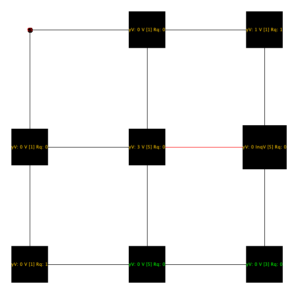

# Sander's distributed mutual exclusion algorithm

### Introduction

To implement Sander's algorithm [1][2] it was used [Sinalgo](https://sinalgo.github.io/), which is a simulation framework for testing and validating network algorithms. To understand better how Sinalgo work and how to use it I trully recommend read the [tutorial](https://sinalgo.github.io/tutorial/Documentation.html) in Sinalgo's website.

### Implementation

At this report will not be explained how sander's distributed mutual exclusion algorithm work, just some parts that is relevant to explain how it was implemented.

#### Connectivity Model

At Sander's algorithm it was proposed a custom way to group nodes, which does not require that all nodes will communicate with every other node. This grouping method is called *coterie*, and have some requirements:  

```
For a process set { P1, P2, ..., Pm }:
		
. Each process Pi must be associated to one coterie Si in a way that:  
  . Pi must belongs to his own coterie Si; 
  . Always have, at least, one common process between any two coteries; 
```

To make it easier to find a optimal Si coteries (for any N) a common aproximation is to put every process in a matrix sqrt(n) x sqrt(n) and use `Si = row and column processes that contain Pi`. Ex:  

```
	  P1 ------ P2
      |         |
      P3 ------ P4
```

In this example, we will have the following coteries:   

```
	. S1 = { P1, P2, P3 }
	. S2 = { P2, P1, P4 }
	. S3 = { P3, P1, P4 }
	. S4 = { P4, P2, P3 }
```

With every process knowing his own coterie, than it will be necessary to send messages only to them to decide if it is possible to enter in critical session.  
To implement coterie logic in Sinalgo it was implemented a custom `Connectivity Model` that organize all processes in a matrix (using node's id) and connect one process to another if they are at same matrix column or row.  
However, since Sinalgo nodes can't send message to themselfs this lead us to a problem, because the process belongs to his own coterie and must participate to choose which process can enter to critical session. To get around this problem this scenario of sending messages to itself was implemented at Sander's node logic. 

#### Messages

It was implemented one model for each possible message from algorithm.  

	. Yes message
	. Inquired message
	. Release message
	. Relinquish message
	. Request message
	
It is possible to access each model in `nodes/messages` directory. Both Requester and Inquired message carry the timestamp as parameters, which is important for algorithm logic.


#### Message Transmission Model

To make it possible simulate a message delay it was implemented a custom `messageTransmissionModel`. This model will set a random fixed delay with probability Pdelay. Both probability Pdelay and delay time can be configured in `Config.xml`

#### Node

##### Phases
To describe node logic we can split in `preStep`, `postStep` and `step` phases.  

```
   The preStep phase it is where the node can try to ask for critical session.  
   This attempt is managed by a critical session probability constant, that  
   can be configured in Config.xml.  
   
   The postStep phase it is where we increase a global timestamp.  
   
   The step phase it is where each node handle the incomming messages. At this   
   moment it is possible to handle each kind of message and respond (if it is   
   necessary) to a single node or every node inside the coterie. 
```

##### Defered Queue

To implement the defered queue it was used the PriorityQueue data structure that is provided by Java. It was implemented a custom comparator that tells to PriorityQueue how the elements will be priorized.

##### Critical session time

To handle how much time a node will stay in critical session it was implemented a custom timer that start when the node enter at critical session (this time is fixed in 5 rounds, and can't be configured in `Config.xml`). When time runs out `exitCS()` method is fired and the node leave sending a release message to nodes from his coterie.

```
public class CriticalSessionTimer extends Timer {
    private SandersNode node;

    public CriticalSessionTimer(SandersNode n) {
        this.node = n;
    }

    @Override
    public void fire() {
        this.node.exitCS();
    }
}
```

##### Coterie problem solution 

To solve the problem mentioned above, when it is necessary to broadcast a message to all nodes inside the coterie we send a broadcast to all neighbours and a "fake" send to node itself.  

```
private void broadcastToCoterie(Message msg) {
    if (msg instanceof YesMessage) {
        sendYes(this);
        broadcast(msg);
    } else if (msg instanceof InqMessage) {
        sendInq(this, ((InqMessage) msg).timestamp);
        broadcast(msg);
    } else if (msg instanceof RequestMessage) {
        sendRequest(this, ((RequestMessage) msg).timestamp);
        broadcast(msg);
    } else if (msg instanceof RelinquishMessage) {
        sendRelinquish(this);
        broadcast(msg);
    } else if (msg instanceof ReleaseMessage) {
        sendRelease(this);
        broadcast(msg);
    }
}
```

This "fake" send happens because it is not possible to send messages to itself, so this send methods handle the message automatically if target node it is the same as the sender node. This will make us close to reality, since messages from node to itself will never have delay. Below there is an example for send yes message, which is similar to every other send message method.  

```
private void sendYes(Node target) {
    if (targetEqualToSender(target, this)) {
       handleYes(this);
    } else {
       send(new YesMessage(), target);
    }
}
```

##### Display

To help understand what is happening at Sinalgo's interface were setted texts, custom colors and shapes.  

The node text tell us how many yes votes `[yV]` this node receive, if this node has voted, not voted or inquired vote `[NotV, V or InqV]`, which node is his candidate (if exists) `[candidateID]` and how many relinquish message this node sends `[Rq]`.  
The shape tell us if the node is in critical session or not (circle when it is in critical session and square if not).  
The colors tells us the node state, that can be in critical session (red), waiting for critical session (yellow) and not trying to enter in critical session (green).



### Configuration

As mentioned above it is possible to configure fixed delay transmission and critical session probability in `Config.xml`. It is also possible to edit some Sinalgo's configuration in this file.

```
<Custom>
    <RandomFixDelayTransmission DelayProbability="0.5" Delay="3.0" />
    <Node defaultSize="10"/>
    <GeometricNodeCollection rMax="100000"/>
    <CriticalSessionProbability value="0.2"/>
</Custom>
```

### Logging

It is possible to enable logging for debug in `LogL` file. Just set `debugLog` to true if want to enable or false to disable.

```
public static final boolean debugLog = true
```

This will print some helper texts to understand what is happening during execution, like incomming messages and defered queue state.  
By default the logfile will be located in the logs folder in the root directory of sinalgo (maybe will be a hidden directory...). 


### Scenarios:

It was used a fixed number of rounds (100) and 50% of delay probability in all scenarios to make relinquish events measure.

**25 nodes**

| Critical Session probability (%) | Relinquish events  |
|----------------------------------|--------------------|
| 20%                              | 11                 |
| 50%                              | 19                 |
| 80%                              | 31                 |

**64 nodes**

| Critical Session probability (%) | Relinquish events  |
|----------------------------------|--------------------|
| 20%                              | 45                 |
| 50%                              | 68                 |
| 80%                              | 88                 |

When we have more nodes we will have a larger coterie, this will increase the chance of getting colisions asking for critical session, which can result in inquired votes. This justify the relinquish events increase from 25 nodes in comparision with 64 nodes.  
When we set a higher chance to ask for critical session we will increase the possibility of each node to ask for it. This will also increase colisions chance, since increase the chance of nodes from same coterie ask for critical session.

### References

<font size="1">
	[1] [Sanders87] The information structure of Distributed Mutual Exclusion Algorithms, ACM Trans. On
Computer Systems, 5(3), 1987.  
	[2] [Sanders96] Data Refinement of mixed specification: A Generalization of UNITY, Dept. of CISE,
University of Florida, Tech. Report 96-010
</font>
